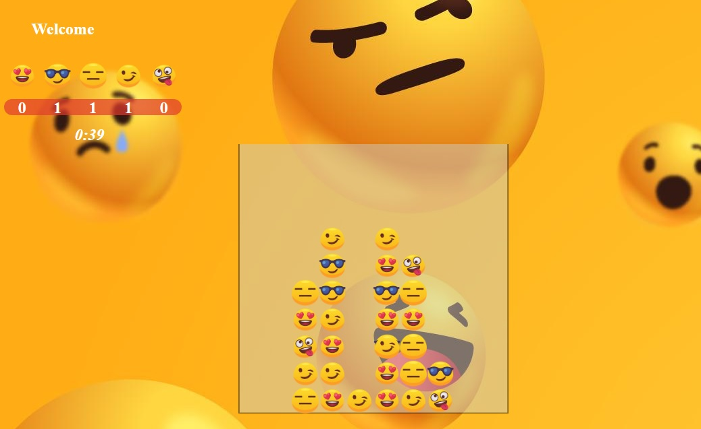

# Falling Emojis Game  Project

## How to play

Clone in to your computer using (git clone https://github.com/i-bassem/Falling-Emojis-Game.git) comand in cmd 
then open the HTML file and start having fun

OR just open this Link =====>> https://i-bassem.github.io/Falling-Emojis-Game/

## Description

Falling Emoji Game, Try to crash 3 similar emojis in a row or column

## Methods used:

1- setInterval()
2- .addEventListener()
3- getBoundingClientRect()

